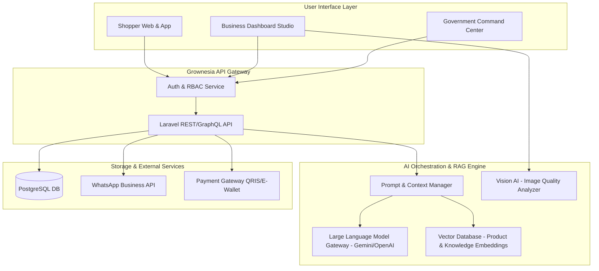

# Product Requirement Document (PRD)
# Grownesia - Ekosistem Ekonomi & E-Commerce UMKM Berbasis AI

---

| Document Information | Detail |
| :--- | :--- |
| **Nama Produk** | Grownesia |
| **Versi Document** | 1.0.0 |
| **Status** | Final Draft / Approved for Design & Dev |
| **Target Launch** | Q4 2026 |
| **Pemilik Produk** | Product Team Grownesia |

---

## 1. Ringkasan Eksekutif & Visi Produk

### 1.1 Visi Utama
**Grownesia** adalah platform ekosistem ekonomi digital terintegrasi berbasis Artificial Intelligence (AI) yang menghubungkan konsumen, pelaku usaha lokal (UMKM, Supplier, Distributor, Koperasi, BUMDes, Reseller), serta pemerintah daerah dalam satu platform yang inklusif, cerdas, dan berdampak sosial tinggi.

### 1.2 Misi & Value Proposition
1. **Bagi Konsumen (Shopper):** Pengalaman belanja cerdas dengan bantuan AI Shopping Assistant, perbandingan produk akurat, serta visibilitas dampak sosial (*Impact Score*) dari setiap pembelian terhadap perekonomian lokal.
2. **Bagi Pelaku Bisnis (Business Account):** Pusat operasional digital 360° yang dilengkapi AI Business Coach, AI Financial Assistant, AI Marketing Center, serta Omnichannel WhatsApp untuk meningkatkan omzet dan efisiensi operasional.
3. **Bagi Pemerintah (Government Account):** Dashboard intelijen ekonomi makro daerah berbasis AI (*AI Policy Simulator* & *Economic Insight*) untuk mengukur performa ekonomi riil dan membuat kebijakan tepat sasaran.

---

## 2. Matriks Pengguna & Struktur Peran (User Roles)

| Peran (Role) | Tipe Akun | Deskripsi Singkat | Fitur Utama Akses |
| :--- | :--- | :--- | :--- |
| **Consumer / Buyer** | Personal | Pembeli akhir (masyarakat umum) | Search, AI Assistant, Gift Bundling, Product Comparison, Impact Score, Checkout, Review. |
| **Business Account** | Business | Pelaku usaha (UMKM, Supplier, Distributor, Koperasi, BUMDes, Reseller) | Dashboard Bisnis, AI Product Optimizer, AI Inventory, AI Marketing Center, Omnichannel WA, AI Financial Assistant. |
| **Government Account** *(Opsional)* | Institutional | Instansi pemerintah (Dinas Koperasi, Pemda, Dinas Perdagangan) | Economic Dashboard, AI Economic Insight, Program Recommendation, Event Management, AI Policy Simulator. |
| **Super Admin** | System Admin | Tim internal pengelola platform Grownesia | Master Dashboard, Verifikasi Bisnis, AI Management, CMS, Integration Center, Platform Insight. |

---

## 3. Spesifikasi Fitur Utama & Kebutuhan Fungsional

### 3.1 Modul Pembeli (Consumer Experience)

#### F-CON-01: Modern E-Commerce Standard Flow
* **Deskripsi:** Pencarian produk, filter kategori lokal, keranjang belanja, checkout multi-kurir, dan metode pembayaran digital (QRIS, E-Wallet, Transfer Bank).
* **Kriteria Penerimaan (Acceptance Criteria):**
  * Pencarian instant dengan autocomplete dan pencarian berbasis bahasa alami (natural language search).
  * Sistem penilaian & review produk transparan dilengkapi foto/video pengguna.

#### F-CON-02: AI Shopping Assistant & Smart Gift Recommendation
* **Deskripsi:** Asisten belanja berbasis AI yang dapat memproses kueri spesifik pengguna dan menyusun paket rekomendasi produk.
* **Contoh Kasus Penggunaan:**
  * **Pencarian Konteks:** Kueri *"Saya ingin hadiah untuk ibu umur 50 tahun"* $\rightarrow$ AI menganalisis preferensi dan menampilkan rekomendasi kurasi (kain batik, set kopi herbal, atau kerajinan khas).
  * **Paket Budget (Gift Bundling):** Kueri *"Saya punya budget Rp300.000"* $\rightarrow$ AI menyusun otomatis paket bundel gabungan UMKM, contoh: *Paket Keripik (Rp45rb) + Kopi (Rp75rb) + Batik (Rp120rb) + Tas Anyaman (Rp55rb) = Total Rp295.000*.
* **Output AI:** Komposisi paket, total harga, tombol "Tambahkan Semua Paket ke Keranjang".

#### F-CON-03: AI Product Comparison
* **Deskripsi:** Komparasi berdampingan (side-by-side) antara dua produk sejenis yang membingungkan pembeli.
* **Contoh Kasus:** Membandingkan *"Kopi Gula Aren"* vs *"Kopi Klepon"*.
* **Fitur AI:**
  * Menganalisis perbedaan komposisi rasa, tingkat kemanisan, daya tahan produk, ulasan konsumen, serta profil UMKM pembuatnya.
  * Memberikan rekomendasi kesimpulan ringkas untuk mempermudah keputusan pembeli.

#### F-CON-04: Impact Score System (Dampak Sosial Ekonomi)
* **Deskripsi:** Indikator dampak sosial yang ditampilkan pada halaman produk dan ringkasan checkout untuk mengedukasi konsumen atas kontribusi mereka.
* **Contoh Tampilan Metrik Impact:**
  * *"Dengan membeli produk ini, Anda membantu 3 pekerja lokal dan mendukung pemberdayaan 1 desa berkembang di Sukabumi."*
* **Kalkulasi:** Dihitung dari data terverifikasi profil UMKM (jumlah tenaga kerja lokal, status BUMDes/Koperasi).

#### F-CON-05: AI Personal Shopper (History-Aware)
* **Deskripsi:** AI yang mempelajari riwayat transaksi, preferensi kategori, dan kebiasaan belanja pengguna untuk memberikan rekomendasi proaktif personal saat pengguna kembali ke platform.

---

### 3.2 Modul Business Account (UMKM, Supplier, Koperasi, BUMDes, Reseller)

#### F-BUS-01: AI Business Dashboard
* **Deskripsi:** Dashboard pusat operasional dengan visualisasi metrik utama secara real-time.
* **Elemen Visual:** Omzet harian/bulanan, statistik penjualan, jumlah pelanggan unik, produk terlaris vs produk yang mengalami penurunan tren, campaign aktif, serta **Business Health Score (0-100)**.
* **AI Insight Widget:** Rekomendasi otomatis harian (contoh: *"Penjualan Keripik Pedas turun 15% minggu ini. Pertimbangkan promo akhir pekan"*).

#### F-BUS-02: Product Management & AI Product Optimizer
* **Deskripsi:** Pengelolaan katalog produk yang dilengkapi asisten perbaikan kualitas listing secara real-time saat pembuatan/pengeditan produk.
* **Fungsi AI Optimizer:**
  * Menganalisis foto produk (contoh: *"⚠️ Foto terlalu gelap. Gunakan pencahayaan alami atau latar belakang terang"*).
  * Rekomendasi perbaikan judul produk agar SEO-friendly dan pembuatan deskripsi otomatis yang menarik.

#### F-BUS-03: Order & AI Inventory Prediction
* **Deskripsi:** Pengelolaan pesanan masuk serta prediksi kebutuhan persediaan barang.
* **Fungsi AI Inventory:** Menganalisis kecepatan penjualan produk dan memprediksi tanggal stok akan habis, serta memberikan peringatan dini restock sebelum stok habis.

#### F-BUS-04: AI Business Coach
* **Deskripsi:** Chatbot konsultan bisnis proaktif 24/7 khusus untuk pelaku UMKM.
* **Fungsi:** Memberikan jawaban atas pertanyaan strategi pemasaran, operasional bisnis, penetapan harga produk, hingga manajemen modal kerja.

#### F-BUS-05: AI Marketing Center
* **Deskripsi:** Studio konten otomatis untuk promosi bisnis di berbagai channel.
* **Fungsi AI:**
  * **Copywriting Engine:** Pembuatan deskripsi promosi, caption Instagram/TikTok, dan pesan siaran WhatsApp secara otomatis.
  * **Design Creator:** Template generator poster, banner promo digital, dan ide tagar (hashtag) populer yang relevan.

#### F-BUS-06: Omnichannel Marketing Integration
* **Deskripsi:** Integrasi pemasaran multi-saluran terhubung langsung ke WhatsApp Business API dan media sosial.
* **Fungsi:** Pengiriman konfirmasi otomatis pesanan via WA, promosi massal ke pelanggan setia, serta integrasi respons pesan otomatis.

#### F-BUS-07: AI Financial Assistant
* **Deskripsi:** Alat analisis keuangan pintar tanpa memerlukan keahlian akuntansi rumit.
* **Fungsi:** Prediksi *Cashflow* (arus kas) 30 hari ke depan, perhitungan *Profit Margin* per produk, serta analisis titik impas (*Break-Even Point / BEP*).

---

### 3.3 Modul Government (Instansi Pemda / Dinas Koperasi & Perdagangan - Opsional)

#### F-GOV-01: Regional Economic Dashboard
* **Deskripsi:** Dashboard pemantauan kondisi ekonomi makro daerah berbasis data teragregasi UMKM.
* **Metrik Agregat:** Jumlah UMKM aktif terdaftar, total omzet regional, volume transaksi bulanan, produk terlaris regional, serta peta persebaran aktivitas ekonomi tertinggi (hotspots).

#### F-GOV-02: AI Economic Insight & Trend Analysis
* **Deskripsi:** Mesin analisis AI yang membaca anomali dan tren pertumbuhan sektor ekonomi daerah.
* **Contoh Output Insight:**
  * *"Kategori Kuliner Olahan Kopi naik 18% di Kecamatan A, namun kategori Kerajinan Tangan turun 5%."*
  * *"Rekomendasi Tindakan: Kecamatan A berpotensi menjadi Sentra Industri Kopi. Disarankan mengadakan Pelatihan Pemasaran Digital dan Bantuan Alat Roasting."*

#### F-GOV-03: Program & Event Management
* **Deskripsi:** Modul pengelolaan program bantuan/pelatihan dinas dan manajemen pameran/event UMKM daerah yang direkomendasikan oleh AI berdasarkan kebutuhan riil data di lapangan.

#### F-GOV-04: AI Policy Simulator
* **Deskripsi:** Alat simulasi berbasis AI yang memungkinkan pemerintah menguji dampak dari sebuah kebijakan sebelum diterapkan.
* **Contoh Simulasi:** *"Jika Pemda memberikan subsidi ongkir 20% untuk UMKM sektor batik selama 3 bulan, diperkirakan omzet meningkat 35% dan menyerap 120 tenaga kerja baru."*

---

### 3.4 Modul Super Admin

#### F-ADM-01: Master Platform Dashboard
* **Deskripsi:** Pusat kendali seluruh platform Grownesia.
* **Metrik Utama:** Total User, Active Business Accounts, Total Government Entities, Volume Transaksi Platform, Status AI Engine Requests/min, Server Health & Response Time.

#### F-ADM-02: Business Verification & Risk Management
* **Deskripsi:** Verifikasi keabsahan dokumen legalitas UMKM, BUMDes, Koperasi, serta penyaringan risiko kecurangan.

#### F-ADM-03: AI Management & Integration Center
* **Deskripsi:** Monitoring penggunaan token API AI, manajemen prompt template, fine-tuning model AI, serta konfigurasi integrasi pihak ketiga (Payment Gateway, Courier API, WA Gateway).

#### F-ADM-04: Platform AI Insight
* **Deskripsi:** AI yang memberikan masukan operasional bagi manajemen Grownesia untuk optimasi infrastruktur dan pertumbuhan bisnis secara nasional.

---

## 4. Alur Kerja & Orkestrasi AI (AI Architecture Overview)

---

## 5. Persyaratan Non-Fungsional (Non-Functional Requirements)

| Kategori | Spesifikasi & Target Benchmark |
| :--- | :--- |
| **Performa UI** | First Contentful Paint (FCP) $< 1.2$ detik; Time to Interactive (TTI) $< 2.5$ detik. |
| **Waktu Respon AI** | Generasi teks AI $< 2.0$ detik; Analisis gambar (Vision AI) $< 3.0$ detik. |
| **Skalabilitas** | Mampu menangani hingga 10,000 *concurrent active users* dan 1,000 *AI requests/minute*. |
| **Keamanan** | Enkripsi end-to-end (TLS 1.3), OAuth2 dengan JWT, sanitasi input ketat, dan perlindungan OWASP Top 10. |
| **Kepatuhan Data** | Memenuhi Undang-Undang Perlindungan Data Pribadi (UU PDP) Indonesia; Pengisolasian data agregat pemerintah. |

---

## 6. Metrik Keberhasilan & KPI

1. **Adopsi Pembeli:** Tingkat retensi pembeli ($>40\%$), tingkat konversi rekomendasi paket AI ($>25\%$).
2. **Efisiensi UMKM:** Penghematan waktu pembuatan konten promosi ($>80\%$), peningkatan rerata omzet mitra UMKM ($>30\%$).
3. **Dampak Daerah:** Jumlah tenaga kerja lokal yang berhasil dipetakan dan diberdayakan melalui metrik *Impact Score*.

---
*Dokumen ini merupakan panduan spesifikasi produk sah untuk implementasi platform Grownesia.*
